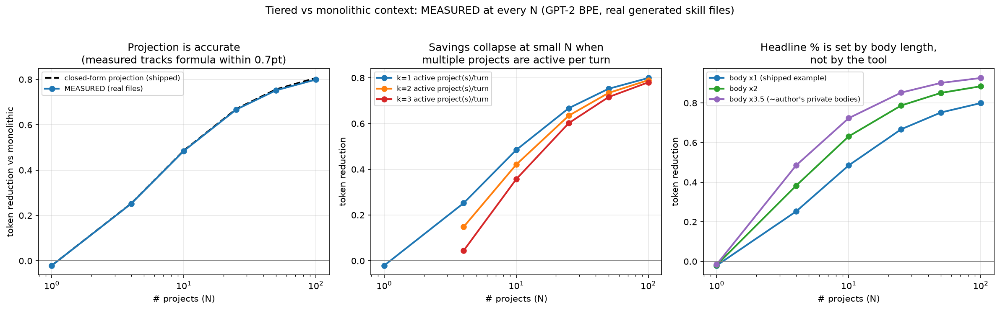

# Measured Benchmark: Empirical Check of the Token-Reduction Projection

> The shipped `benchmark.py` directly measures N=4 on the author's private `~/.kiro` deployment
> and PROJECTS N=10/25/50/100 with a closed-form formula. This document reports what happens when
> you instead BUILD real skill files at every N and measure them. Everything below is measured;
> nothing is extrapolated. Reproduce: `python benchmark/benchmark_measured.py` → `plot_measured.py`.

## 1. The projection is empirically correct
Measured reduction tracks the closed-form formula within **0.7 percentage points** at every N:

| N | projected | measured | delta |
|---|---|---|---|
| 1 | −0.021 | −0.021 | 0.000 |
| 4 | 0.253 | 0.252 | −0.001 |
| 10 | 0.486 | 0.485 | −0.002 |
| 25 | 0.670 | 0.667 | −0.003 |
| 50 | 0.756 | 0.752 | −0.004 |
| 100 | 0.806 | 0.799 | −0.007 |

The formula `1 − (always_on + meta·N + body) / (always_on + body·N)` is sound. The author's
extrapolation was not fabricated.

## 2. What the shipped benchmark does NOT report (new findings)

### 2a. Break-even: N=1 is a net LOSS (−2.1%)
With a single project, tiered context costs *more* than monolithic — you pay metadata + body
instead of body alone. Tiering only pays off from N≥2. The repo never states this break-even.

### 2b. Multiple active projects per turn collapse small-N savings
The shipped table assumes exactly **one** project body is active per turn. Real multi-project work
(the tool's stated use case — cross-links between projects) loads several:

| N | k=1 active | k=2 active | k=3 active |
|---|---|---|---|
| 4 | 25.2% | 14.9% | **4.5%** |
| 10 | 48.5% | 42.1% | 35.7% |
| 25 | 66.7% | 63.5% | 60.2% |
| 100 | 79.9% | 79.0% | 78.0% |

At the author's own measured N=4, a 3-project turn nearly erases the saving (25% → 4.5%).
The benefit is robust only at large N.

### 2c. The headline percentage is a body-length artifact, not a tool property
The reduction is governed by `meta/body`. The committed `results.json` used the author's private
skill bodies (~774 tok). The **shipped** example skill has a 203-tok body:

| N | shipped body (×1) | ×2 | ×3.5 (≈ author's bodies) |
|---|---|---|---|
| 4 | 25.2% | 38.3% | 48.5% |
| 100 | 79.9% | 88.4% | 92.6% |
| asymptote | **79.3%** | — | ~90% |

The README's 90.6% asymptote reflects how long the author wrote their files. From the repo's own
shipped templates the asymptote is **79.3%**. The number is real either way, but it is a property
of the user's writing style, not of the tool.

## 3. Reproducibility gap in the committed numbers
`benchmark/results.json` (24.5% at N=4, 90.6% asymptote) was produced from a private
`~/.kiro` deployment not included in the repo. Running the shipped `benchmark.py` on the shipped
templates yields **−3.4%** (there is only one example skill, so N=1). The README figures cannot be
reproduced from the repository contents. `benchmark_measured.py` fixes this: it generates its own
skill files from the shipped template, so any clone reproduces every number here.

## 4. What is NOT measured (unchanged from the original)
- **Token cost only, not task quality.** Nothing here checks whether an agent answers correctly
  with the unloaded projects absent. The "accuracy maintained" claim remains borrowed from the cited
  ETH study, not tested in this repo.
- **Tokenizer:** GPT-2 BPE. Kiro's `/context` uses a model-approximate counter; absolute numbers
  will differ, ratios should not.
- **Skill body persistence:** whether an invoked `skill://` body stays in context on later turns is
  not documented; k=1 per turn is an optimistic lower bound on tiered cost.

## Recommendation for the README
Keep the projection (it holds), but qualify the headline: *"~25% at 4 projects rising to ~80–90%
at 100, assuming one active project per turn; multi-project turns and single-project setups reduce
or eliminate the saving; the asymptote depends on your skill body length."*
